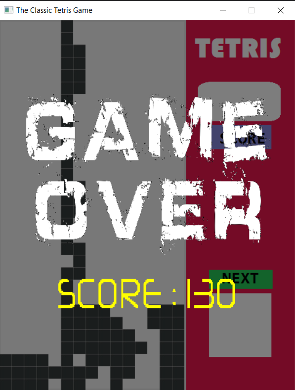

<h1 align="center">The Classic Tetris Game: C++ SDL2</h1>

  

  

  

  

  <!-- 

  

   -->

## Status

<h4 align="center">
	Built in 2018. Ready to play!
</h4>

  <a href="#dart-about">About</a> &#xa0; | &#xa0; 
  <a href="#checkered_flag-illustrations">Illustrations</a> &#xa0; | &#xa0;
  <a href="#white_check_mark-setup">Setup</a> &#xa0; | &#xa0;
  <a href="#rocket-resources">Resources</a> &#xa0; | &#xa0;
  <a href="https://github.com/rahul-badgujar" target="_blank">Author</a>

 

## :dart: About

The Classic Tetris Game, the game you all must have played atleast once in your life. In Tetris, players complete lines by moving differently shaped pieces (tetrominoes), which descend onto the playing field. The completed lines disappear and grant the player points, and the player can proceed to fill the vacated spaces. The game ends when the playing field is filled.
This projects tried to implement the Tetris Game in C++ using SDL2 Graphics Libraries.
Fork, Clone and Make your changes!
Install, Build and Play!!!

|  |  |
|:---:|:---:|
|            Source Code            |            Demo Video             |

## :checkered_flag: Illustrations

Here are some Illustration of Game

|  |  |  |
| :--------------------------: | :--------------------------------: | :-------------------------------: |
|      Game Introduction       |            How to Play             |            Gameplay 1             |

|  |  |  |
| :-------------------------------: | :-------------------------------: | :------------------------------: |
|            Gameplay 2             |            Gameplay 3             |            Game Over             |

And all rest at [more screens](illustrations/)

## :white_check_mark: Setup

- Fork the repository to your Github Account.
- Clone the repository to your local machine using `git clone`.
- This project is a Visual Studio C++ Project. Make sure you have Visual Studio installed. If not installed, [Install Visual Studio Community](https://visualstudio.microsoft.com/vs/features/cplusplus/).
- Open the Project File i.e, "The Classic Tetris Game.sln" file in Visual Studio. All the SDL2 related headers and binaries are already present in the codebase. Visual Studio Project is configured to include related configuations and paths. So no extra customization is needed.
- Now build the project. The project should build fine. But when you will try to run the application (.exe file), an error will occur saying "DLL Files missing". This is because we need some Dynamic Linked Library (DLL Files) to be able to run SDL2 programs. Follow the further steps to resolve this error.
- Download and extract the [DLL Files for SDL2 zip](https://drive.google.com/file/d/1iMXjTjQFSRf9nmjDGz74GxqrWdJmOFXq/view?usp=sharing) . This DLL files are runtime files that are essential for SDL2 Programs to run.
- Copy all the dll files from extracted directory and paste it in `C:\Windows\System32` directory of your Windows Computer.
- Now build again and try to run the program.
- If all steps followed correctly, you should be able to see The Classic Tetris Game starting for you.
- Play, Enjoy, and also provide your feedback. If you found any bug, please raise a Issue.
- Contributions are most welcome...

## :rocket: Resources

The following Resources were used in this project:

- [Lazyfoo SDL2 Tutorials](https://lazyfoo.net/tutorials/SDL/)
- [SDL2 Headers and Binaries](https://www.libsdl.org/)
- [SLD2 Wiki](http://wiki.libsdl.org/FrontPage)
